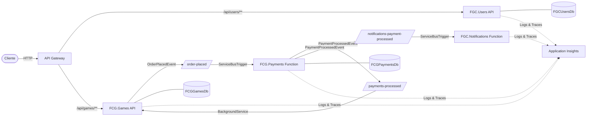
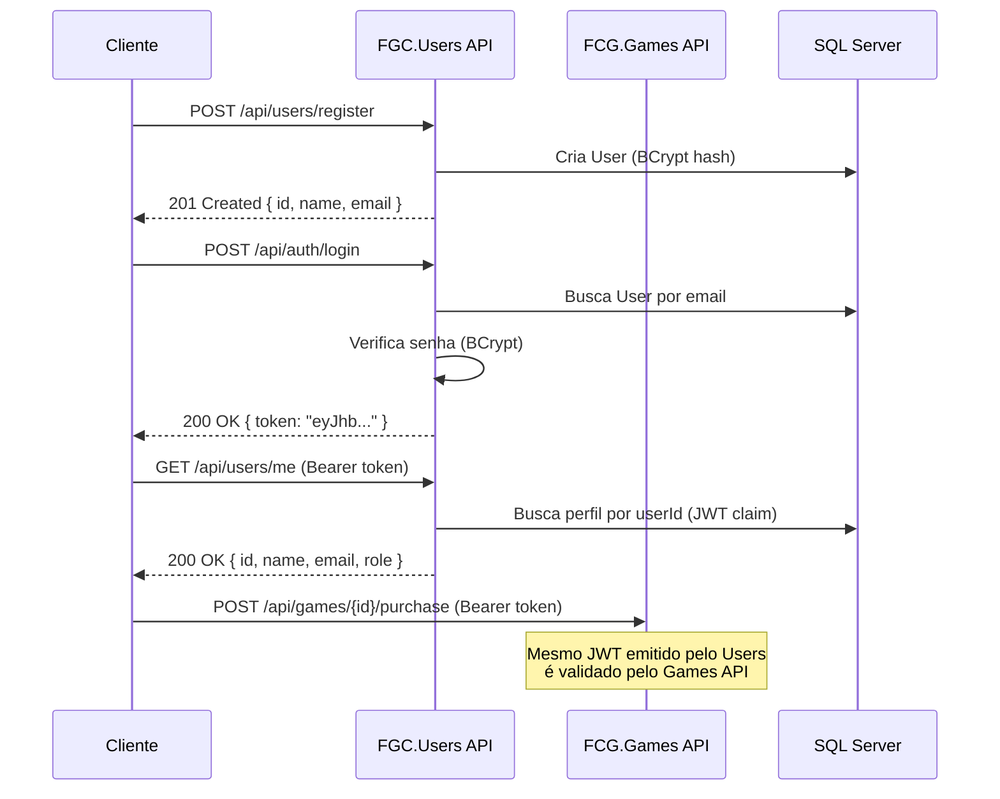
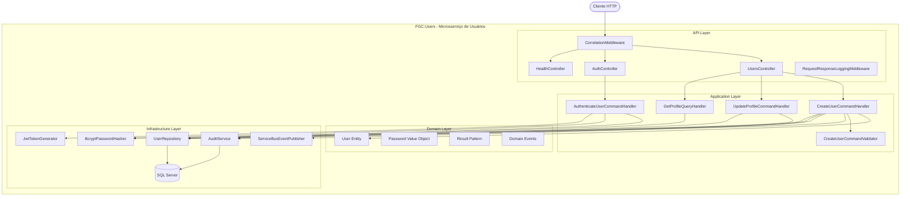

# FGC.Users API

Microsserviço de cadastro, autenticação e gerenciamento de perfis de usuários, desenvolvido com .NET 8 e ASP.NET Core Web API. Projeto da **Fase 3 do Tech Challenge — PosTech FIAP**.

## Fluxo de Comunicação entre Microsserviços



## Fluxo de Autenticação



## Diagrama de Arquitetura



## Arquitetura

O projeto segue **Clean Architecture** com **CQRS**, organizado em 4 camadas:

```
src/
├── FGC.Users.Domain/           # Entidades, Value Objects, Eventos (zero dependências NuGet)
├── FGC.Users.Application/      # Commands, Queries, Handlers, Validators (FluentValidation), DTOs
├── FGC.Users.Infrastructure/   # EF Core (SQL Server), BCrypt, JWT, Audit, Service Bus
└── FGC.Users.API/              # Controllers, Middlewares, Startup (JWT + Swagger)
tests/
└── FGC.Users.UnitTests/        # 42 testes unitários (xUnit + Moq + FluentAssertions)
```

**Fluxo de dependências:** Domain ← Application ← Infrastructure; API → Application + Infrastructure

## Endpoints

| Método | Rota | Auth | Descrição |
|--------|------|------|-----------|
| `POST` | `/api/users/register` | Não | Registrar novo usuário |
| `POST` | `/api/auth/login` | Não | Autenticar e obter JWT |
| `GET` | `/api/users/me` | JWT | Obter perfil do usuário logado |
| `PUT` | `/api/users/me` | JWT | Atualizar perfil do usuário logado |
| `GET` | `/health` | Não | Health check |
| `GET` | `/ready` | Não | Readiness check |

## Domínio

### Entidades

| Entidade | Campos principais |
|----------|-------------------|
| `User` | Id, Name, Email, Password (VO), Role, IsActive, CreatedAtUtc, UpdatedAtUtc |
| `AuditEvent` | Id, AggregateType, AggregateId, EventType, BeforeJson, AfterJson, CreatedAtUtc, CorrelationId, TraceId, UserId |

### Eventos de Domínio

| Evento | Descrição |
|--------|-----------|
| `UserRegistered` | Emitido ao registrar usuário (UserId, Email, Name) |
| `UserProfileUpdated` | Emitido ao atualizar perfil (UserId, campos alterados) |

## Configuração

| Variável | Descrição | Padrão |
|----------|-----------|--------|
| `ConnectionStrings__Default` | Connection string do SQL Server | (obrigatório) |
| `Jwt__Key` | Chave secreta para assinar tokens JWT (32+ chars) | `super-secret-key-for-dev-environment-only` |
| `Jwt__Issuer` | Emissor do token JWT | `fgc.local` |
| `Jwt__Audience` | Audiência do token JWT | `fgc.clients` |
| `ApplicationInsights__ConnectionString` | Application Insights (opcional) | (desabilitado se vazio) |

## CI/CD

Pipeline GitHub Actions (`.github/workflows/ci-cd.yml`):

- **CI** (push + PR na master): restore → build → test
- **CD** (apenas push na master): build Docker → push ACR → deploy Azure Container App

## Build & Run

```bash
# Build
dotnet build

# Executar API (http://localhost:5081)
dotnet run --project src/FGC.Users.API

# Executar testes (42 testes)
dotnet test
```

## Docker

```bash
# Build
docker build -f src/FGC.Users.API/Dockerfile -t fgc-users .

# Run
docker run -p 5081:8080 \
  -e ConnectionStrings__Default="Server=tcp:..." \
  -e Jwt__Key="super-secret-key-for-dev-environment-only" \
  fgc-users
```

## Testes

42 testes unitários com xUnit + Moq + FluentAssertions:

| Categoria | Testes |
|-----------|--------|
| Commands (CreateUser, AuthenticateUser, UpdateProfile) | 18 |
| Queries (GetProfile) | 4 |
| Validators (CreateUserCommandValidator) | 10 |
| Domain (User Entity, Password VO) | 10 |

## Observabilidade

- **Serilog** com sinks para Console e Application Insights
- **CorrelationMiddleware** propaga `x-correlation-id` entre requests
- **RequestResponseLoggingMiddleware** loga request/response com mascaramento de dados sensíveis
- **Audit Trail** com snapshots before/after de entidades
- **Application Insights** para logs, traces e métricas centralizados

## Tecnologias

- .NET 8.0 / ASP.NET Core Web API
- Entity Framework Core 8 (SQL Server)
- FluentValidation
- BCrypt.Net
- Serilog + Application Insights
- xUnit + Moq + FluentAssertions
