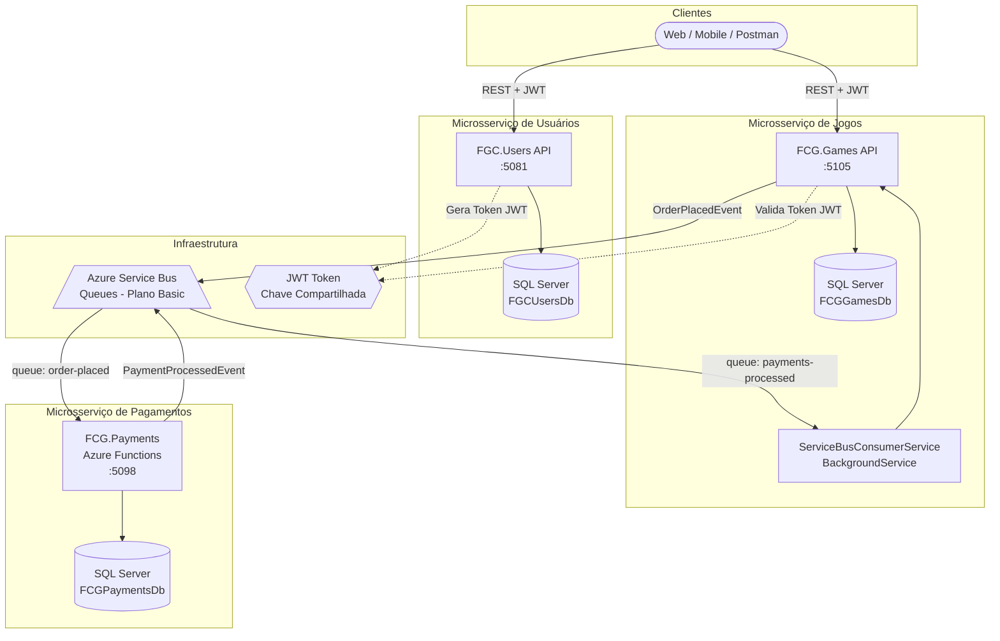
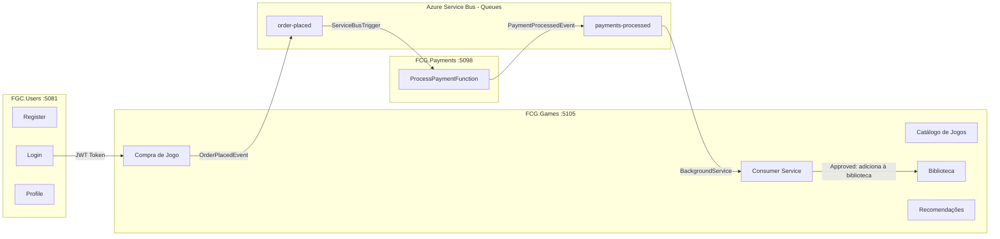
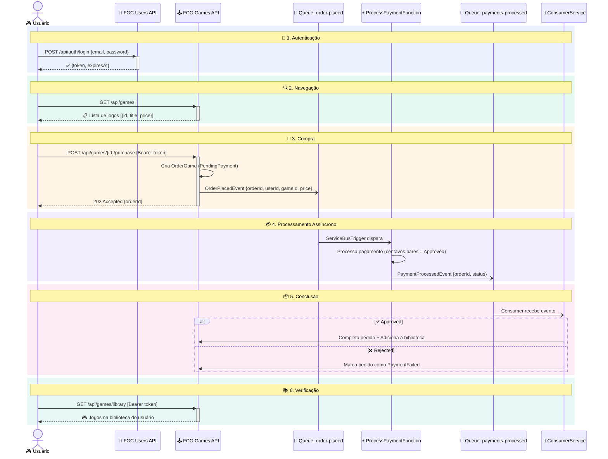
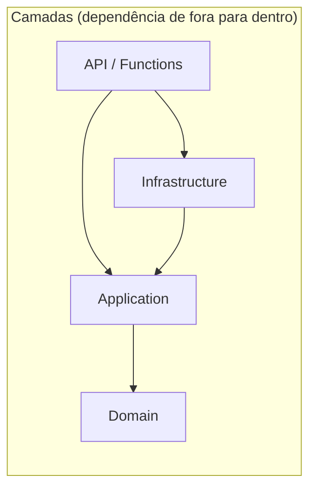
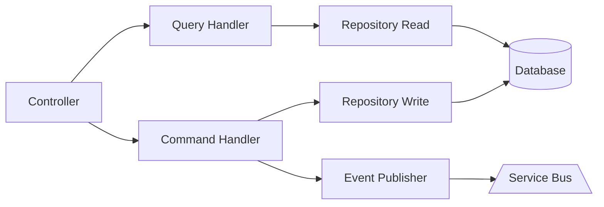
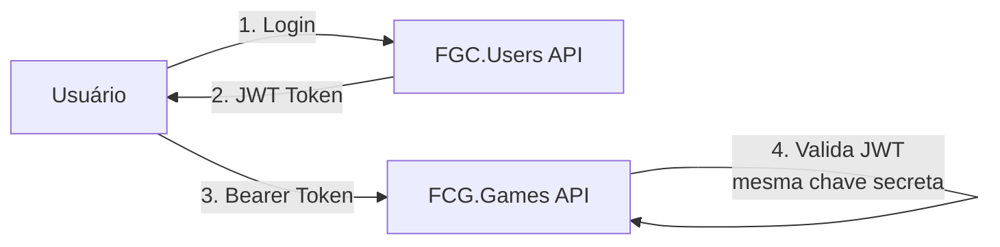
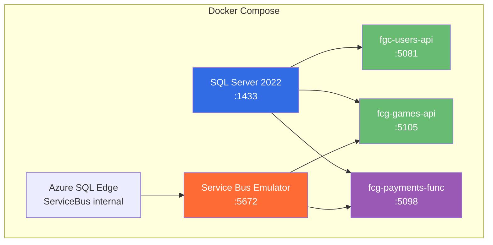

# Arquitetura do Sistema — FIAP Cloud Games (FCG)

Documentação de arquitetura e fluxo de comunicação entre os microsserviços do projeto FCG, desenvolvido na **Fase 3 do Tech Challenge — PosTech FIAP**.

## Visão Geral da Arquitetura

O sistema é composto por **3 microsserviços independentes**, cada um com seu próprio banco de dados e repositório, comunicando-se de forma assíncrona via **Azure Service Bus (Queues)**.

## Diagrama de Comunicação entre Microsserviços

## Fluxo Completo de Compra (E2E)

## Padrões Arquiteturais

### Clean Architecture

Cada microsserviço segue Clean Architecture com 4 camadas:

| Camada | Responsabilidade |
|--------|-----------------|
| **Domain** | Entidades, Value Objects, Eventos, Interfaces de repositório. Zero dependências externas. |
| **Application** | Commands, Queries, Handlers (CQRS), DTOs, Validadores. Depende apenas de Domain. |
| **Infrastructure** | EF Core, Service Bus, Repositórios, JWT, Audit. Implementa interfaces de Domain/Application. |
| **API / Functions** | Controllers, Middlewares, DI, Startup. Ponto de entrada HTTP ou trigger. |

### CQRS (Command Query Responsibility Segregation)

- **Commands**: CreateGame, UpdateGame, DeleteGame, PlaceOrder
- **Queries**: ListGames, GetGameById, GetRecommendations, GetUserLibrary
- **Events**: OrderPlacedEvent, PaymentProcessedEvent

### Comunicação entre Microsserviços

| De | Para | Mecanismo | Queue |
|----|------|-----------|-------|
| FCG.Games | FCG.Payments | Azure Service Bus (async) | `order-placed` |
| FCG.Payments | FCG.Games | Azure Service Bus (async) | `payments-processed` |
| Cliente | FGC.Users | REST (sync) | — |
| Cliente | FCG.Games | REST (sync) | — |

### Segurança

- **JWT Bearer Token** compartilhado entre Users e Games (mesma chave, issuer e audience)
- **Roles**: `User` (comprar jogos) e `Admin` (CRUD de jogos)
- **Claim `sub`**: identificador único do usuário propagado nos eventos

### Observabilidade

| Componente | Implementação |
|------------|---------------|
| **Logs estruturados** | Serilog com Console + Application Insights sinks |
| **Correlation ID** | Middleware propaga `x-correlation-id` entre requests e eventos |
| **Audit Trail** | Games: override de `SaveChangesAsync` no EF Core. Users: `AuditService` com before/after JSON |
| **Tracing** | Serilog enrichers (MachineName, ThreadId, ServiceName) |

### Infraestrutura (Docker Compose)

| Container | Imagem | Porta |
|-----------|--------|-------|
| `fcg-sqlserver` | `mcr.microsoft.com/mssql/server:2022-latest` | 1433 |
| `fcg-servicebus-sql` | `mcr.microsoft.com/azure-sql-edge:latest` | — |
| `fcg-servicebus` | `mcr.microsoft.com/azure-messaging/servicebus-emulator:latest` | 5672 |
| `fcg-users-api` | Build local (Alpine .NET 8) | 5081 |
| `fcg-games-api` | Build local (Alpine .NET 8) | 5105 |
| `fcg-payments-func` | Build local (Azure Functions .NET 8) | 5098 |
